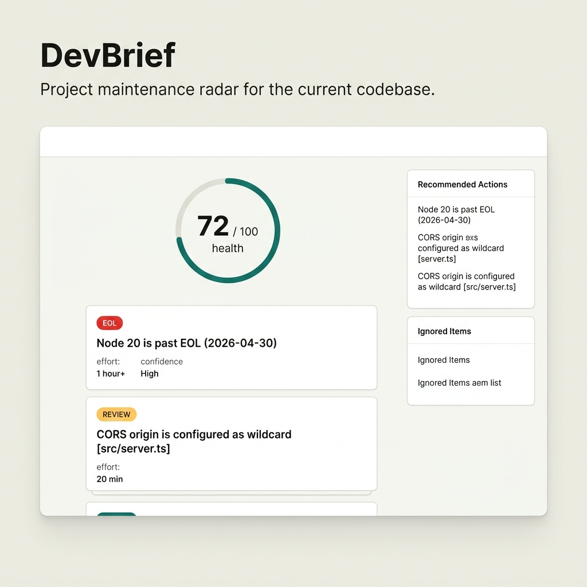

# DevBrief

**Project Maintenance Intelligence for Developers.**

DevBrief is a local-first, zero-setup CLI that analyzes your codebase imports and configuration files to tell you what actually needs your attention, what will break, and what you can safely ignore.

---

## What is DevBrief?

**DevBrief sits between:**
*   **Dependabot / Renovate** (which generate constant automated update noise)
*   **Snyk / Trivy** (which dump massive, context-free vulnerability reports)
*   **endoflife.date** (which lists raw runtime lifecycle timelines)

Instead of generating more alerts, DevBrief helps you decide what actually deserves attention today.



---

## 🩺 The Flagship Workflow: Doctor Scan

Run a fast, zero-configuration local scan on a repository:

```bash
npx devbrief doctor --path examples/fixtures/npm-app
```

```text
EOL: Node 18 is past EOL (2025-04-30)
Health: 38/100
Breakdown:
  Runtime Lifecycle:   0/25
  Dependency Risk:     9/25
  Infrastructure:      25/25
  Security & Services: 4/25

Detected: JavaScript/TypeScript (Express)
Package manager: npm
Scanned: 3 files, 3 dependencies, 1 runtime, 0 infra, 0 config/security, 0 service signals

EOL: Node 18 is past EOL (2025-04-30)  [package.json]
  Evidence: smallest safe path: Node 22 or 24 or 26 LTS
  Decision: upgrade, 1 hour+, confidence: High
  Why this matters: Security fixes and critical patches no longer ship after a runtime reaches End-of-Life (EOL).

REVIEW: Express app has no helmet dependency  [package.json]
  Evidence: add security headers if this serves public HTTP traffic
  Decision: review, 5 min, confidence: Medium
  Why this matters: Weak security postures leave your endpoints vulnerable to scanning bots and automated attacks.

REVIEW: better-sqlite3 may need rebuilds on Node upgrades  [package.json]
  Decision: review, 20 min, confidence: High
  Why this matters: Drift in runtime versions between development and production can cause silent runtime crashes.

REVIEW: Package "better-sqlite3" is declared in manifests but never imported in code  [package.json]
  Evidence: safe to remove if not used for tooling or dynamic/peer loading
  Decision: review, 5 min, confidence: High
  Why this matters: Unused dependencies bloat the container image size, slow down npm install times, and increase the security attack surface.

Ignored: 7 low-signal items hidden by default
Next: upgrade - Node 18 is past EOL (2025-04-30) (1 hour+)
```

---

## ⚡ The Hero Feature: Multi-Ecosystem Upgrade Confidence

Every scanner can tell you when a package is out of date. DevBrief is different: it parses your imports in JavaScript/TypeScript, Python, Go, and Rust to check if upgrading a package will break your code.

```bash
npx devbrief upgrade express --target 5.0.0 --path examples/fixtures/npm-app
```

```text
UPGRADE WITH REVIEW: express
Installed: 4.18.2
Target: 5.0.0
Effort: 20 min

RISKY: express 4.18.2 -> 5.0.0 crosses a major version  [src/server.ts]
  Evidence: touches code you actually use in 1 file
  Decision: review, 20 min, confidence: High
  Why this matters: Major version updates cross breaking-change boundaries, meaning they change APIs and require code updates.
```

---

## Who It Is For

*   **Solo developers** tired of sorting through automated update noise.
*   **Open-source maintainers** who want to keep CI and base configurations clean.
*   **Startup teams** seeking a zero-setup view of code and runtime technical debt.
*   **Developers** who value high-signal, actionable maintenance decisions.

---

## CLI Commands Reference

Scan-based primary and secondary commands (`doctor`, `risk`, `runtime`, `infra`, `security`, `services`) support formatting options (e.g. for CI/CD integrations) via the `--format` flag:
*   `--format text` (Default CLI output)
*   `--format markdown` (Collapsible GitHub Summary markdown format)
*   `--format json` (Raw JSON payload)
*   `--format quiet` (Print only summary statistics, sets correct exit codes)

### Primary Commands
*   `npx devbrief doctor` — Runs the smart maintenance radar and shows what needs attention first.
*   `npx devbrief upgrade <package>` — Advise whether a dependency upgrade is safe for this project.
*   `npx devbrief runtime` — Checks runtime EOL lifecycle state (alias: `node-upgrade`).
*   `npx devbrief inbox` — Lists only urgent items and quick safe wins.

### Secondary Commands
*   `npx devbrief risk` — Scan dependency and vulnerability risk.
*   `npx devbrief infra` — Check Docker, Compose, and CI runner configurations.
*   `npx devbrief security` — Check security posture (committed `.env`, wildcard CORS, debug flags).
*   `npx devbrief services` — Detect drift in third-party API SDKs.
*   `npx devbrief weekly` — Builds a compact weekly maintenance plan.
*   `npx devbrief fix` — Applies conservative maintenance fixes (interactive menu in TTY; or `--safe-only`).
*   `npx devbrief clean-secrets` — Extract hardcoded secrets and placeholders into `.env` and update imports.
*   `npx devbrief shield -- <cmd>` — **[Optional / Advanced]** Run a command under DevBrief runtime sandbox protection.
*   `npx devbrief init-hook` — Install a Git pre-commit hook to run scans automatically.

---

## Trust Model

*   **Local First:** Scans and evaluates entirely on your machine.
*   **Calm & Conservative:** Low-signal or speculative alerts are hidden by default.
*   **Zero Configuration:** Works without API keys, environment files, or SaaS accounts.
*   **Resilient:** Degrades gracefully when network registries or API endpoints are offline.

---

## Documentation Links

*   [docs/RISK_GUIDE.md](docs/RISK_GUIDE.md) — Scoring, confidence levels, and maturity categories.
*   [docs/SHIELD.md](docs/SHIELD.md) — Vibe Shield runtime sandboxing, command blocking, and preloaders.
*   [docs/CONFIG.md](docs/CONFIG.md) — Port overrides, registry offline environment configurations, and file layout.
*   [docs/ARCHITECTURE.md](docs/ARCHITECTURE.md) — Execution blocks, static scanner types, and project context loader.
*   [docs/EXAMPLES.md](docs/EXAMPLES.md) — Sample console outputs for every subcommand.

---

## Contributing

We welcome small, evidence-backed improvements. Please read [CONTRIBUTING.md](CONTRIBUTING.md) to get started.

---

## Legacy Compatibility

For backwards compatibility, the legacy release briefing pipeline remains available. Commands (`devbrief run` and `devbrief stack`) and database schemas are fully isolated. See [docs/LEGACY.md](docs/LEGACY.md) for details.
