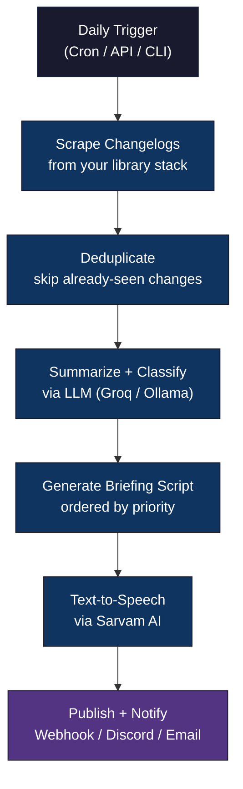
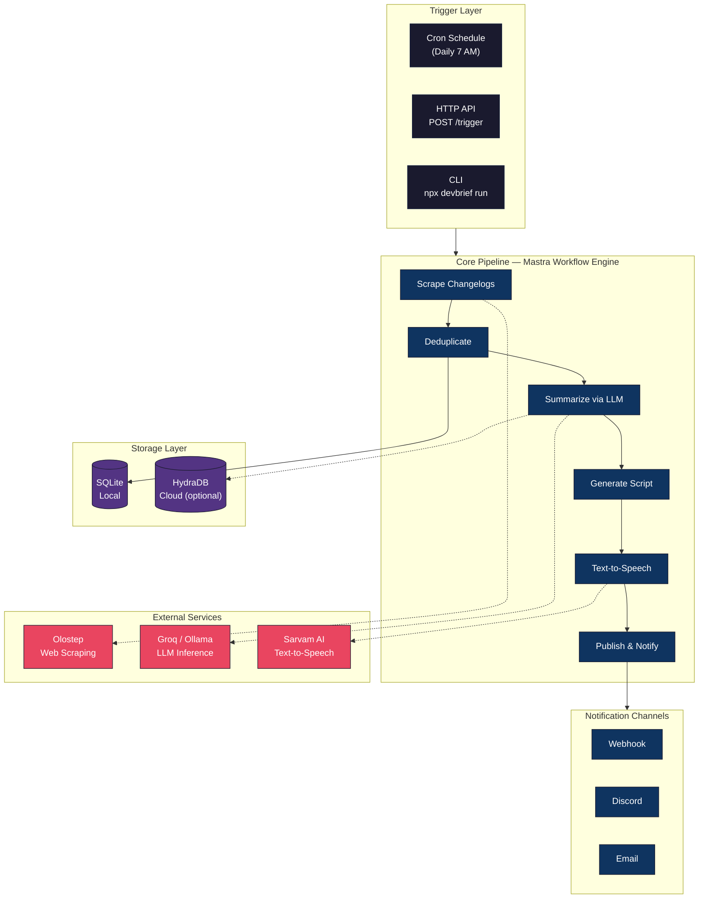
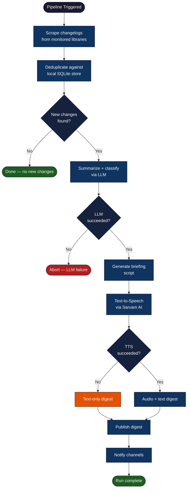
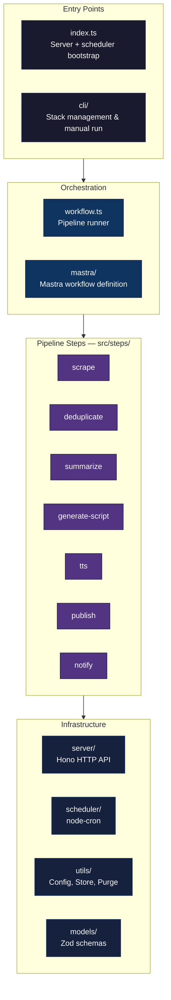

# DevBrief

An AI agent that monitors your library stack, scrapes changelogs daily, and delivers a concise voice briefing on what changed and what needs action.

Instead of manually checking GitHub releases, Twitter, and docs across the 10–30 libraries you actively use, DevBrief collapses that into a 2-minute voice briefing each morning.

## How It Works

DevBrief runs a sequential pipeline on a daily cron schedule (or on demand):



Each step is fault-isolated — a TTS failure still produces a text-only digest, and a single library's scrape failure doesn't block others.

## Prerequisites

- **Node.js 18+**
- **ffmpeg** (required for audio concatenation)
- **Tailscale** (for secure self-hosted access)

### Installing ffmpeg

**macOS:**

```bash
brew install ffmpeg
```

**Ubuntu / Debian:**

```bash
sudo apt update && sudo apt install ffmpeg
```

**Fedora:**

```bash
sudo dnf install ffmpeg
```

### Installing Tailscale

Follow the official guide at [https://tailscale.com/download](https://tailscale.com/download) to install and join your tailnet.

## Installation

```bash
# Clone the repository
git clone <repo-url>
cd devbrief

# Install dependencies
npm install

# Copy the example environment file
cp .env.example .env

# Edit .env and fill in your API keys (see Environment Variables below)
```

## Environment Variables

Copy `.env.example` to `.env` and configure the following:

| Variable | Required | Description | Default |
|----------|----------|-------------|---------|
| `GROQ_API_KEY` | Yes (if using Groq) | API key for Groq LLM provider | — |
| `OLLAMA_BASE_URL` | Yes (if using Ollama) | Base URL for local Ollama instance | — |
| `OLOSTEP_API_KEY` | Yes | API key for Olostep web scraping | — |
| `SARVAM_API_KEY` | Yes | API key for Sarvam AI text-to-speech | — |
| `PAPERCLIP_API_KEY` | Conditional | API key for Paperclip publishing (falls back to local hosting if not set) | — |
| `HYDRADB_API_KEY` | Optional | API key for HydraDB cloud knowledge store | — |
| `HYDRADB_TENANT_ID` | Optional | Tenant ID for HydraDB (required if HYDRADB_API_KEY is set) | — |
| `TAILSCALE_IP` | Optional | Tailscale IP to bind to (auto-detected from `100.x.x.x` interfaces if not set) | Auto-detect |
| `SMTP_HOST` | Optional | SMTP server hostname for email notifications | — |
| `SMTP_PORT` | Optional | SMTP server port | — |
| `SMTP_USER` | Optional | SMTP authentication username | — |
| `SMTP_PASS` | Optional | SMTP authentication password | — |
| `DISCORD_WEBHOOK_URL` | Optional | Discord webhook URL for notifications | — |
| `DEVBRIEF_PORT` | Optional | HTTP server port | `7890` |
| `DEVBRIEF_CRON` | Optional | Cron expression for scheduled runs | `0 7 * * *` |
| `TZ` | Optional | Timezone for cron scheduling | System local |

**Notes:**
- At least one LLM provider is required: set either `GROQ_API_KEY` or `OLLAMA_BASE_URL`.
- SMTP variables are only needed if you configure an email notification channel.
- The cron schedule runs in the system's local timezone. Set `TZ` to override (e.g., `TZ=America/New_York`).

## CLI Usage

### Managing Your Library Stack

Add a library to monitor:

```bash
npx devbrief stack add react --urls "https://github.com/facebook/react/releases"
```

Add a library with multiple changelog URLs:

```bash
npx devbrief stack add next --urls "https://github.com/vercel/next.js/releases,https://nextjs.org/blog"
```

Update URLs for an existing library (upsert behavior):

```bash
npx devbrief stack add react --urls "https://github.com/facebook/react/releases,https://react.dev/blog"
```

Remove a library:

```bash
npx devbrief stack remove react
```

List all monitored libraries:

```bash
npx devbrief stack list
```

### Running the Pipeline Manually

Run the full pipeline from the command line without starting the HTTP server:

```bash
npx devbrief run
```

This triggers the pipeline with `trigger_type: 'manual'` and prints a summary to stdout.

## Server Usage

### Starting the Server

Start the HTTP server and cron scheduler:

```bash
npm start
```

Or in development mode:

```bash
npm run dev
```

The server binds to your Tailscale IP on port 7890 (configurable via `DEVBRIEF_PORT`). The cron scheduler starts automatically and triggers the pipeline based on `DEVBRIEF_CRON` (default: 7 AM daily).

**Authentication:** Tailscale tailnet membership is the sole authentication mechanism. All endpoints are accessible only to devices on your tailnet — no additional app-level auth is needed.

### HTTP Endpoints

**Trigger a pipeline run:**

```bash
curl -X POST http://<tailscale-ip>:7890/trigger
```

Returns `202` with `{ "run_id": "<uuid>" }` on success, or `409` if a run is already in progress.

**List all runs:**

```bash
curl http://<tailscale-ip>:7890/runs
```

Returns an array of run records ordered by `triggered_at` descending.

**Get details for a specific run:**

```bash
curl http://<tailscale-ip>:7890/runs/<run_id>
```

Returns the full run record including status, libraries processed, change count, errors, and links.

**Get the digest for a run:**

```bash
curl http://<tailscale-ip>:7890/digest/<run_id>
```

Returns a JSON response with the briefing script text and audio URL:

```json
{
  "run_id": "abc-123",
  "briefing_script": "Good morning! Here's your DevBrief for...",
  "audio_url": "http://<tailscale-ip>:7890/audio/abc-123.mp3",
  "generated_at": "2025-01-15T07:00:00.000Z"
}
```

**Stream the audio briefing:**

```bash
curl http://<tailscale-ip>:7890/audio/<run_id>.mp3 --output briefing.mp3
```

## Notification Configuration

DevBrief supports three notification channels: webhook, Discord, and email. Configure them by editing `~/.devbrief/notification-config.json`:

```json
{
  "channels": [
    {
      "type": "webhook",
      "url": "https://your-webhook-endpoint.example.com/devbrief"
    },
    {
      "type": "discord",
      "webhookUrl": "https://discord.com/api/webhooks/1234567890/abcdefg"
    },
    {
      "type": "email",
      "smtp": {
        "host": "smtp.gmail.com",
        "port": 587,
        "secure": false,
        "auth": {
          "user": "you@gmail.com",
          "pass": "your-app-password"
        }
      },
      "to": "you@gmail.com"
    }
  ]
}
```

You can configure any combination of channels. If a channel fails, DevBrief logs the failure and continues delivering to the remaining channels.

For email notifications, set the corresponding `SMTP_*` environment variables or provide them inline in the config as shown above.

## Data Storage

DevBrief stores data locally and optionally in the cloud:

**Local (SQLite — always active):**
- **SQLite database:** `~/.devbrief/devbrief.db` — stores change entries and run records
- **Audio files:** `~/.devbrief/audio/` — stores generated MP3 briefings as `{run_id}.mp3`
- **Stack config:** `~/.devbrief/stack-config.json` — your monitored libraries
- **Notification config:** `~/.devbrief/notification-config.json` — notification channel settings

**Cloud (HydraDB — optional):**
- Classified change entries are synced to HydraDB as knowledge items for semantic recall
- Run summaries are stored for cross-device access and future retrieval
- Deduplication always runs against the local SQLite store (HydraDB is a sync layer, not the dedup source)
- Falls back gracefully to SQLite-only if `HYDRADB_API_KEY` is not set

The `~/.devbrief/` directory (including subdirectories) is created automatically on first use.

Run records and change entries older than 30 days are automatically purged at the start of each pipeline run.

## Architecture

DevBrief uses [Mastra](https://mastra.ai) as its workflow orchestration framework. The pipeline is defined using Mastra's `createWorkflow` and `createStep` from `@mastra/core/workflows`, with a unified pipeline state schema flowing through all steps.

[HydraDB](https://docs.usecortex.ai) provides optional persistent cloud storage for classified change entries and run summaries. It acts as a sync layer for cloud access and future semantic recall — deduplication always runs against the local SQLite store. When `HYDRADB_API_KEY` is not set, DevBrief operates in SQLite-only mode (fully functional).

### System Overview



### Pipeline Flow (with error handling)



### Project Structure



## Development

```bash
# Run tests
npm test

# Run tests in watch mode
npm run test:watch

# Build
npm run build

# Start in dev mode (with tsx)
npm run dev
```

## License

MIT
