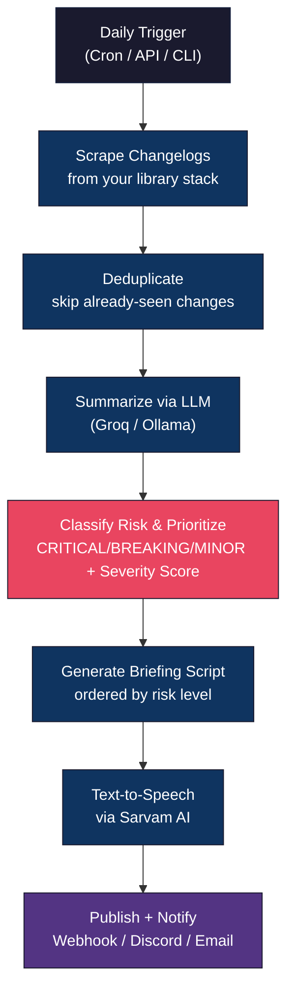
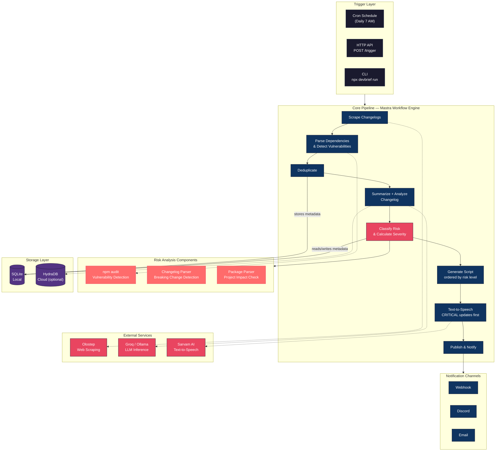
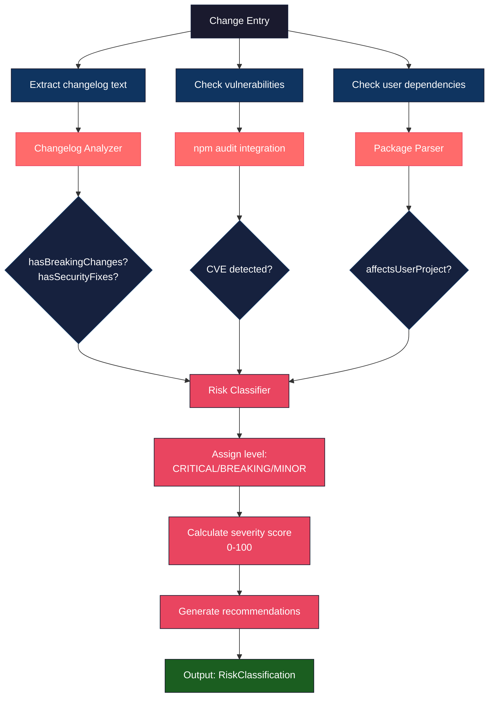
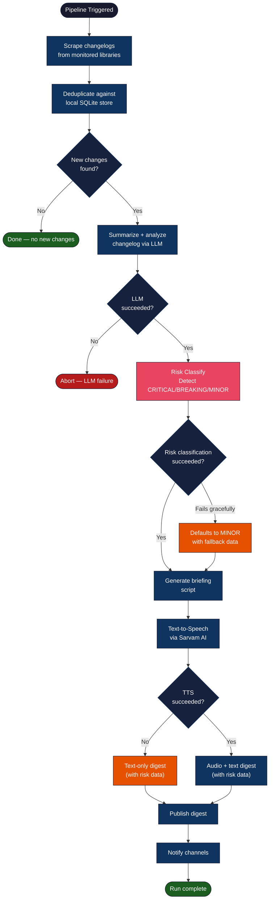
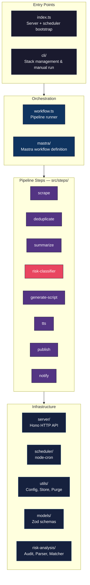

# DevBrief

An AI agent that monitors your library stack, scrapes changelogs daily, and delivers a concise voice briefing on what changed and what needs action.

Instead of manually checking GitHub releases, Twitter, and docs across the 10–30 libraries you actively use, DevBrief collapses that into a 2-minute voice briefing each morning.

---

## How It Works



Every step is fault-isolated. If TTS fails, you still get a text digest. If one library's scrape fails, the others still process normally.

### Risk Classification

DevBrief automatically detects the severity of each change to help you prioritize what to read first. Each change is classified into one of three risk levels:

- **CRITICAL**: Security vulnerabilities (CVEs) affecting your project's dependencies, dangerous API removals, or critical security patches. Detected via `npm audit` against your `package.json`.

- **BREAKING**: API changes, deprecations, or major version upgrades that require code modifications in your project. Identified through changelog parsing and dependency graph analysis to match the change against your actual stack.

- **MINOR**: Feature additions, performance improvements, patch releases, and non-breaking updates. These are safe to defer.

**How it works:**
1. **Vulnerability Detection**: Runs `npm audit` against your monitored libraries to catch CVEs in real-time
2. **Changelog Parsing**: Extracts breaking changes (e.g., "BREAKING: removed X API") from release notes
3. **Dependency Matching**: Checks if the change affects your project's current dependencies
4. **Severity Scoring**: Assigns a 0–100 score based on impact (0 = lowest, 100 = critical security fix)

Each change displays a severity badge: `[CRITICAL]`, `[BREAKING]`, or `[MINOR]`.

---

## Quick Start

```bash
git clone <repo-url>
cd devbrief
npm install
cp .env.example .env
```

Fill in your `.env` (see [Environment Variables](#environment-variables) below), then:

```bash
# Add libraries to monitor
npx devbrief stack add react --urls "https://github.com/facebook/react/releases"
npx devbrief stack add next --urls "https://github.com/vercel/next.js/releases,https://nextjs.org/blog"

# Run the pipeline
npx devbrief run
```

Example output with risk breakdown:

```
Run ID:    a1b2c3d4-...
Status:    completed
Changes:   3 CRITICAL, 0 BREAKING, 8 MINOR updates
Briefing:  "Starting with critical updates: React 19 has a security fix affecting context hooks..."
Audio:     ~/.devbrief/audio/a1b2c3d4.mp3
```

That's it. You'll see scraped changes with risk classification, deduplication results, LLM summaries, and (if configured) an audio briefing generated.

---

## Prerequisites

| Dependency | Why | Install |
|---|---|---|
| **Node.js 18+** | Runtime | [nodejs.org](https://nodejs.org) |
| **ffmpeg** | Stitches audio chunks into a single MP3 | `brew install ffmpeg` (macOS) or `sudo apt install ffmpeg` (Ubuntu) |
| **Tailscale** | Secure access to the HTTP server without exposing ports | [tailscale.com/download](https://tailscale.com/download) |

---

## Environment Variables

Copy `.env.example` to `.env`. The variables are grouped by what they enable.

### Required (pipeline won't run without these)

| Variable | Description |
|---|---|
| `OLOSTEP_API_KEY` | Olostep web scraping — renders JS-heavy pages and returns markdown |
| `SARVAM_API_KEY` | Sarvam AI text-to-speech — converts briefing scripts to audio |

You also need **at least one** LLM provider:

| Variable | Description |
|---|---|
| `GROQ_API_KEY` | Groq cloud LLM (uses Llama 3.3) |
| `OLLAMA_BASE_URL` | Local Ollama instance (e.g. `http://localhost:11434`) |

### Optional — Cloud Sync

These enable cross-device persistence via HydraDB. Without them, DevBrief works fully in local-only mode (SQLite).

| Variable | Description |
|---|---|
| `HYDRADB_API_KEY` | HydraDB cloud knowledge store |
| `HYDRADB_TENANT_ID` | Your HydraDB tenant (required if API key is set) |

### Optional — Notifications

Configure these only if you want push notifications after each run.

| Variable | Description |
|---|---|
| `DISCORD_WEBHOOK_URL` | Discord channel webhook |
| `SMTP_HOST` | SMTP server for email notifications |
| `SMTP_PORT` | SMTP port |
| `SMTP_USER` | SMTP username |
| `SMTP_PASS` | SMTP password |

### Optional — Server Configuration

| Variable | Default | Description |
|---|---|---|
| `TAILSCALE_IP` | Auto-detect | Tailscale IP to bind to (finds `100.x.x.x` automatically) |
| `DEVBRIEF_PORT` | `7890` | HTTP server port |
| `DEVBRIEF_CRON` | `0 7 * * *` | Cron expression (default: 7 AM daily) |
| `TZ` | System local | Timezone for cron (e.g. `America/New_York`) |

### Risk Classification (Automatic)

Risk classification runs automatically for each change and requires no additional environment variables. DevBrief uses `npm audit` internally to detect CVEs, parses changelogs for breaking changes, and scores severity automatically. Results are included in all API responses and the dashboard.

---

## CLI Usage

### Managing Your Library Stack

```bash
# Add a library (single URL)
npx devbrief stack add react --urls "https://github.com/facebook/react/releases"

# Add with multiple changelog sources
npx devbrief stack add next --urls "https://github.com/vercel/next.js/releases,https://nextjs.org/blog"

# Update URLs for an existing library (upsert — replaces URLs, keeps history)
npx devbrief stack add react --urls "https://github.com/facebook/react/releases,https://react.dev/blog"

# Remove a library
npx devbrief stack remove react

# List everything you're monitoring
npx devbrief stack list
```

### Running the Pipeline

```bash
npx devbrief run
```

This runs the full pipeline once (scrape → deduplicate → summarize → script → TTS → publish → notify) and prints a summary:

```
Run ID:    a1b2c3d4-...
Status:    completed
Changes:   3 new
Errors:    0
Audio:     ~/.devbrief/audio/a1b2c3d4.mp3
```

---

## Server Mode

For always-on operation, start the HTTP server with the built-in cron scheduler:

```bash
npm start        # production (compiled)
npm run dev      # development (tsx, auto-reload)
```

The server binds to your Tailscale IP on port 7890. The cron scheduler triggers the pipeline automatically based on `DEVBRIEF_CRON`.

**Authentication:** Tailscale tailnet membership is the only auth. If your device is on the tailnet, you have access. No passwords or tokens needed.

### API Endpoints

| Method | Endpoint | Description |
|---|---|---|
| `POST` | `/trigger` | Start a pipeline run. Returns `202` with `{ "run_id": "..." }`. Returns `409` if already running. |
| `GET` | `/runs` | List all runs (newest first) |
| `GET` | `/runs/:run_id` | Get full details for a specific run |
| `GET` | `/digest/:run_id` | Get the briefing script + audio URL + risk counts as JSON |
| `GET` | `/audio/:run_id.mp3` | Stream/download the audio briefing |
| `GET` | `/dashboard` | HTML risk dashboard with library list, risk badges, and severity breakdown |
| `GET` | `/api/dashboard/summary` | Risk summary JSON (critical/breaking/minor counts) |
| `GET` | `/api/dashboard/changes/:library` | Get all changes for a specific library with risk classifications |

Example — trigger a run and check the risk summary:

```bash
# Trigger
curl -X POST http://100.x.x.x:7890/trigger
# → {"run_id": "a1b2c3d4-..."}

# Get risk summary
curl http://100.x.x.x:7890/api/dashboard/summary
# → {
#     "criticalCount": 3,
#     "breakingCount": 2,
#     "minorCount": 12,
#     "lastUpdate": "2024-01-15T09:30:00Z",
#     "byLibrary": {
#       "react": { "critical": 1, "breaking": 0, "minor": 3 },
#       "next": { "critical": 2, "breaking": 2, "minor": 4 }
#     }
#   }

# Download audio once complete
curl http://100.x.x.x:7890/audio/a1b2c3d4.mp3 --output briefing.mp3
```

---

## Dashboard

The risk dashboard provides a visual summary of all detected changes across your monitored libraries, organized by severity and impact.

### Dashboard View

Access the interactive dashboard at `http://100.x.x.x:7890/dashboard`:

```
┌─────────────────────────────────────────────────────────────────┐
│ DevBrief Risk Dashboard                                     [🔄] │
├─────────────────────────────────────────────────────────────────┤
│                                                                 │
│  Severity Summary                Last Updated: 2024-01-15 9:30 AM
│  ━━━━━━━━━━━━━━━━━━━━━━━━━━━━━━━━━━━━━━━━━━━━━━━━━━━━━━━━━━ │
│                                                                 │
│  🔴 3 CRITICAL    🟠 0 BREAKING    🔵 8 MINOR                  │
│                                                                 │
├─────────────────────────────────────────────────────────────────┤
│ Library Updates                                                 │
├─────────────────────────────────────────────────────────────────┤
│                                                                 │
│  React 19.0.0 [CRITICAL] Security fix for context hooks       │
│  ─────────────────────────────────────────────────────────────│
│  Fix: Prevent memory leaks in React.useContext with StrictMode
│  Published: 2024-01-14                                         │
│                                                                 │
│  Next.js 14.2.0 [BREAKING] New App Router API changes        │
│  ─────────────────────────────────────────────────────────────│
│  Breaking: middleware.ts now requires TypeScript 5.0+         │
│  Published: 2024-01-10                                         │
│                                                                 │
│  Tailwind CSS 4.0.1 [MINOR] Performance improvement           │
│  ─────────────────────────────────────────────────────────────│
│  Feature: 15% faster CSS generation with new JIT compiler     │
│  Published: 2024-01-08                                         │
│                                                                 │
│  ... 5 more minor updates                                       │
│                                                                 │
└─────────────────────────────────────────────────────────────────┘
```

### Summary API Response

Request: `GET /api/dashboard/summary`

Response:

```json
{
  "criticalCount": 3,
  "breakingCount": 0,
  "minorCount": 8,
  "lastUpdate": "2024-01-15T09:30:00Z",
  "totalChanges": 11,
  "byLibrary": {
    "react": {
      "critical": 1,
      "breaking": 0,
      "minor": 3
    },
    "next": {
      "critical": 1,
      "breaking": 1,
      "minor": 2
    },
    "tailwindcss": {
      "critical": 1,
      "breaking": 0,
      "minor": 3
    }
  }
}
```

### Color Coding

The dashboard uses a three-color system:

| Color | Risk Level | Meaning |
|---|---|---|
| 🔴 Red | CRITICAL | Update immediately — security vulnerability or critical fix |
| 🟠 Orange | BREAKING | Plan your upgrade — API changes require code modifications |
| 🔵 Blue | MINOR | Optional — safe to defer, non-breaking features or patches |

---

## Understanding Risk Levels

Each change detected by DevBrief is assigned a risk level to help you prioritize. Use this guide to decide when to update:

### Risk Decision Matrix

| Risk Level | Security? | Code Changes? | When to Update | Example |
|---|---|---|---|---|
| **CRITICAL** | ✅ Yes (CVE) | Maybe | **Immediately** (0–24 hrs) | OpenSSL: Buffer overflow CVE-2024-1234 |
| **CRITICAL** | ❌ No (bug fix) | Maybe | **Within 1 week** | React: Memory leak in useContext |
| **BREAKING** | ❌ No | ✅ Yes | **Plan it** (review changes, test) | Next.js: Middleware API rewrite |
| **MINOR** | ❌ No | ❌ No | **Batch with other updates** | Tailwind: Performance improvement |

### Details by Risk Level

#### CRITICAL

**What it means**: A security vulnerability (CVE) affecting your project's dependencies, or a critical bug fix required for stability.

**Examples**:
- `express@4.19.0`: CVE-2024-43344 — Denial of Service in HTTP parsing
- `lodash@4.17.20`: Critical memory leak in `_.debounce`

**Action**: Update immediately. These patches are backward-compatible and essential.

#### BREAKING

**What it means**: An API change, deprecation, or major version upgrade that requires code modifications in your project.

**Examples**:
- `next@14.0.0`: App Router requires migrating from `pages/` directory
- `react-query@5.0.0`: `useQuery` hook signature changed; `isLoading` renamed to `isPending`

**Action**: Plan your upgrade. Review the migration guide, write tests, and schedule time to refactor.

#### MINOR

**What it means**: New features, performance improvements, or patch releases. Non-breaking and safe to defer.

**Examples**:
- `tailwindcss@4.0.0`: New `@supports` directive for CSS feature queries
- `axios@1.6.0`: Patch fixing headers on retries

**Action**: Optional. Batch these with your regular dependency updates (e.g., monthly).

---

DevBrief can notify you after each run via webhook, Discord, or email. Configure channels in `~/.devbrief/notification-config.json`:

```json
{
  "channels": [
    {
      "type": "webhook",
      "url": "https://your-endpoint.example.com/devbrief"
    },
    {
      "type": "discord",
      "webhookUrl": "https://discord.com/api/webhooks/..."
    },
    {
      "type": "email",
      "smtp": {
        "host": "smtp.gmail.com",
        "port": 587,
        "secure": false,
        "auth": { "user": "you@gmail.com", "pass": "app-password" }
      },
      "to": "you@gmail.com"
    }
  ]
}
```

Use any combination. If one channel fails, the others still deliver.

---

## Data Storage

### Local (always active — no configuration needed)

All data lives in `~/.devbrief/` (created automatically on first run):

| Path | Contents |
|---|---|
| `devbrief.db` | SQLite database — change entries, run records, dedup index |
| `audio/` | Generated MP3 briefings (`{run_id}.mp3`) |
| `stack-config.json` | Your monitored libraries |
| `notification-config.json` | Notification channel settings |

Data older than 30 days is automatically purged at the start of each run.

### Cloud Sync via HydraDB (optional)

When `HYDRADB_API_KEY` is set, classified change entries and run summaries are synced to [HydraDB](https://docs.usecortex.ai) for:

- Cross-device access (run from laptop, check from phone)
- Semantic recall ("what breaking changes did I see this month?")

Important: deduplication always runs against local SQLite. HydraDB is a sync layer, not the dedup source. If the API key isn't set, everything works normally in local-only mode.

---

## Architecture

Built with [Mastra](https://mastra.ai) for workflow orchestration. Each pipeline step is a `createStep()` that chains via `.then()`. A unified `pipelineStatus` field flows through all steps — if any step fails, downstream steps skip cleanly.

### System Overview



### Risk Classification Flow



### Error Handling



### Project Structure



---

## Development

```bash
npm test          # Run tests (vitest)
npm run test:watch  # Watch mode
npm run build     # Compile TypeScript
npm run dev       # Dev server with tsx (auto-reload)
```

---

## License

MIT
